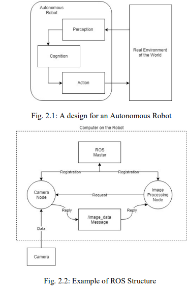
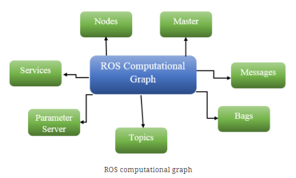
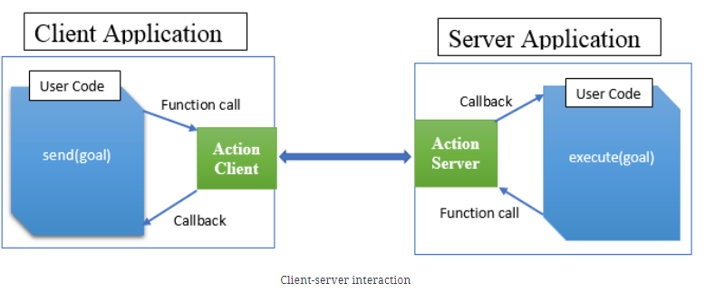

# Readings

## WFH: Is VR New Solution (2021)

Roll, Shawn C. PhD; Lucas, Gale M. PhD; Becerik-Gerber, Burcin DDes Authors’ Response to “Work From Home (WFH) During COVID-19: Is Virtual Reality (VR) a New Solution to New Problems?”, Journal of Occupational and Environmental Medicine: October 2021 - Volume 63 - Issue 10 - p e757-e758 doi: 10.1097/JOM.0000000000002340. [WFH_VR.pdf](WFH_VR.pdf).

This article discusses the transition to a more permenant WFH situtation, and the challenges of with segmenting the office from residence. Potential solutions exist with VR and AR technologies that create different context.

## Building Robotics with RoboMaker (2018)

Develop, Test and Deploy Intelligent Robotics Applications with AWS RoboMaker. Open Source FOR You. November 2018. Accessed November 6, 2021. [EBSCO](https://search.ebscohost.com/login.aspx?direct=true&db=edsggo&AN=edsgcl.568304329&site=eds-live&scope=site). [Develop_Test_and_Deploy_Intell.pdf](Develop_Test_and_Deploy_Intell.pdf).

RoboMaker is a simulation service where developers build `Robot Operating System` bots that interact with a virtual world.  ROS is the most widely used open source robotics framework.  Additionally, ML and other AWS technology integrates with the RoboMaker -- making it ideal for bridging multiple topics from this program.

## ROS with Smart Garbage Bins (2020)

Cheong, W. S., Kamarulzaman, S. F., & Rahman, M. A. (2020). Implementation of Robot Operating System in Smart Garbage Bin Robot with Obstacle Avoidance System. 2020 Emerging Technology in Computing, Communication and Electronics (ETCCE), Computing, Communication and Electronics (ETCCE), 2020 Emerging Technology In, 1–6. https://doi.org/10.1109/ETCCE51779.2020.9350912. [IEEE](https://ieeexplore.ieee.org/document/9350912). [ROS_with_SmartGarbageBins](ROS_with_SmartGarbageBins.pdf).

The authors create a smart garbage bin that detects its full and navigates to the sanitation endpoint (via GPS & Computer Vision). They use Ultrasounic waves to detect near-by objects and avoid running into to objects. This capability enables scaling out the bins to more places without requiring more humans.  In places like Malaysia that is a critical need to combat public litering.

> Robot Operating System (ROS) is an open-source, meta-operating system for a robot that acts as an operating system for provide services including hardware abstraction, low-level device control, implementation of commonly-used functionality, message-passing between processes, and package management.

## ROS Cookbook

Bipin, K (June 2018).  Robot Operating System Cookbook.  Packet Publishing. [OReilly](https://learning.oreilly.com/library/view/robot-operating-system/9781783987443/). [GitHub](https://github.com/kbipin/Robot-Operating-System-Cookbook).

ROS has a notion of packages and metapackages (formally stacks), which contain the artifacts for a specific function.  Packages communicate async using a topic (pub/sub) moodel.  Developers write these packages using C++, [Python3](http://wiki.ros.org/UsingPython3/SourceCodeChanges), Java, MATLAB, etc.  There is a notion of [computation graphs](https://learning.oreilly.com/library/view/robot-operating-system/9781783987443/6e343cab-3788-4f04-97ad-db3f441770d6.xhtml) which share a network of nodes, services, parameters, and topics.  Any resource can access this graph using `roscpp` or `rospython` client libraries, and querying the `master` node (think like DNS).

### What is catkin (2020)

Van Eeden (2020). [Cached](WhatIsCatkin.pdf). [catkin is the official build system of ROS](http://wiki.ros.org/catkin/conceptual_overview) and the successor to the original ROS build system, rosbuild. catkin combines CMake macros and Python scripts to provide some functionality on top of CMake's normal workflow. catkin was designed to be more conventional than rosbuild, allowing for better distribution of packages, better cross-compiling support, and better portability. catkin's workflow is very similar to CMake's but adds support for automatic 'find package' infrastructure and building multiple, dependent projects at the same time.

### What is actionlib

The [ROS tools provide the actionlib package](https://learning.oreilly.com/library/view/robot-operating-system/9781783987443/4d99b64a-8fcd-44c3-b7b6-4843bbfc71af.xhtml) to create servers that execute long-running goals that could be preempted or resubmitted. The actionlib package consists of ActionClient and ActionServer, which communicate via a "ROS Action Protocol" built on top of ROS messages via function calls and callbacks.

These are defined as goal, feedback, and result messages:

- **Goal**: We will introduce the notion of a goal as tasks that are accomplished using actions which can be sent to ActionServer by ActionClient. For example, in the case of a mobile robot, the goal would be to choose the next pose ( x, y, z, phi, chi, theta), which has information about where the mobile robot should move to in the world.
- **Feedback**: ActionServer provides a feedback message to ActionClient, which defines a way to tell the incremental progress of a goal periodically. In the case of the mobile robot, this might be the current pose of the robot, along with other information.
- **Result**: Upon completion of this goal, ActionServer sends the result message to ActionClient, which is quite different from a feedback message, since it is sent exactly once and is extremely useful in some cases. However, in the case of the mobile robot, the result isn't very important, but it might contain the final pose of the robot.

### What is pluginlib

There is a notion of Plugins which enable extensibility through `.so` file.  You need to `PLUGINLIB_EXPORT_CLASS` which [registers the class definitions](https://learning.oreilly.com/library/view/robot-operating-system/9781783987443/8c2a4c13-5ff3-42cd-9f8d-1251d9a0d0e1.xhtml).  Afterward, the `pluginlib::ClassLoader<T>` can import those with assistance from an **your_plugin.xml** definition.

### What are nodelets

These are analogous to system threads and allow multiple components to execute within a given process.  The [loading procedure](https://learning.oreilly.com/library/view/robot-operating-system/9781783987443/44d132e8-6489-4099-870d-706dc02af268.xhtml) uses the `pluginlib`.  Also [launch files](https://learning.oreilly.com/library/view/robot-operating-system/9781783987443/a70a375a-c4c7-4536-ae0a-2f310749bb5d.xhtml) support declaring these loading operations removing boilerplate code.