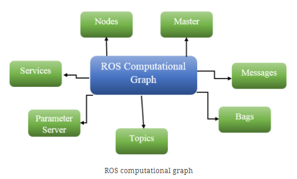
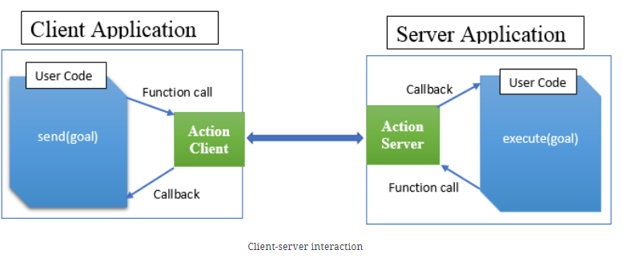
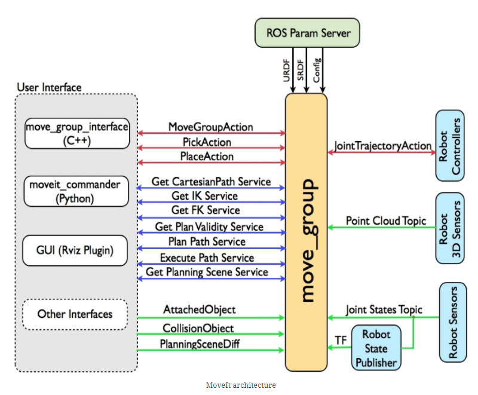

# ROS Cookbook

Bipin, K (June 2018).  Robot Operating System Cookbook.  Packet Publishing. [OReilly](https://learning.oreilly.com/library/view/robot-operating-system/9781783987443/). [GitHub](https://github.com/kbipin/Robot-Operating-System-Cookbook).

## What is a package

ROS has a notion of packages and metapackages (formally stacks), which contain the artifacts for a specific function.  Packages communicate async using a topic (pub/sub) moodel.  Developers write these packages using C++, [Python3](http://wiki.ros.org/UsingPython3/SourceCodeChanges), Java, MATLAB, etc.  There is a notion of [computation graphs](https://learning.oreilly.com/library/view/robot-operating-system/9781783987443/6e343cab-3788-4f04-97ad-db3f441770d6.xhtml) which share a network of nodes, services, parameters, and topics.  Any resource can access this graph using `roscpp` or `rospython` client libraries, and querying the `master` node (think like DNS).



## What is catkin (2020)

Van Eeden (2020). [Cached](WhatIsCatkin.pdf). [catkin is the official build system of ROS](http://wiki.ros.org/catkin/conceptual_overview) and the successor to the original ROS build system, rosbuild. catkin combines CMake macros and Python scripts to provide some functionality on top of CMake's normal workflow. catkin was designed to be more conventional than rosbuild, allowing for better distribution of packages, better cross-compiling support, and better portability. catkin's workflow is very similar to CMake's but adds support for automatic 'find package' infrastructure and building multiple, dependent projects at the same time.

## What is actionlib

The [ROS tools provide the actionlib package](https://learning.oreilly.com/library/view/robot-operating-system/9781783987443/4d99b64a-8fcd-44c3-b7b6-4843bbfc71af.xhtml) to create servers that execute long-running goals that could be preempted or resubmitted. The actionlib package consists of ActionClient and ActionServer, which communicate via a "ROS Action Protocol" built on top of ROS messages via function calls and callbacks.



These are defined as goal, feedback, and result messages:

- **Goal**: We will introduce the notion of a goal as tasks that are accomplished using actions which can be sent to ActionServer by ActionClient. For example, in the case of a mobile robot, the goal would be to choose the next pose ( x, y, z, phi, chi, theta), which has information about where the mobile robot should move to in the world.
- **Feedback**: ActionServer provides a feedback message to ActionClient, which defines a way to tell the incremental progress of a goal periodically. In the case of the mobile robot, this might be the current pose of the robot, along with other information.
- **Result**: Upon completion of this goal, ActionServer sends the result message to ActionClient, which is quite different from a feedback message, since it is sent exactly once and is extremely useful in some cases. However, in the case of the mobile robot, the result isn't very important, but it might contain the final pose of the robot.

## What is pluginlib

There is a notion of Plugins which enable extensibility through `.so` file.  You need to `PLUGINLIB_EXPORT_CLASS` which [registers the class definitions](https://learning.oreilly.com/library/view/robot-operating-system/9781783987443/8c2a4c13-5ff3-42cd-9f8d-1251d9a0d0e1.xhtml).  Afterward, the `pluginlib::ClassLoader<T>` can import those with assistance from an **your_plugin.xml** definition.

## What are nodelets

These are analogous to system threads and allow multiple components to execute within a given process.  The [loading procedure](https://learning.oreilly.com/library/view/robot-operating-system/9781783987443/44d132e8-6489-4099-870d-706dc02af268.xhtml) uses the `pluginlib`.  Also [launch files](https://learning.oreilly.com/library/view/robot-operating-system/9781783987443/a70a375a-c4c7-4536-ae0a-2f310749bb5d.xhtml) support declaring these loading operations removing boilerplate code.

## What is Gazebo

> Gazebo is a 3D simulator framework which can accurately and efficiently simulate a wide range of robots in a complex environment. Although it is a simulator framework, Gazebo is similar to game engines but offers physics simulation at a much higher degree of consistency and integrity. [...] Gazebo is independent of the ROS framework, and so using plugins, we can access and extend all the components of Gazebo. As usual, we can organize the Gazebo plugins into six types:

- World
- Model
- Sensor
- System
- Visual
- GUI

```sh
sudo apt-get install libgazebo7-dev 
```

In Gazebo, we can develop our own virtual worlds such as offices, residential space, mountains, and so on, using the SDF file format. Here, we will use a map of a residential space that has been created using the Gazebo GUI and saved as robot.world ([SDF file format](http://gazebosim.org/tutorials/?tut=build_model)) in the chapter6_tutorials/robot_gazebo/ folder. The robot with a map of residential space is shown in the preceding screenshot.

## What is transform frame

This library functions are a wrapper around publishing a robots location, to other robots, making it easy to follow or avoid one another.

> The ROS TF library has been developed to provide a standard method in order to keep track of coordinate frames and transform data within the entire system so that individual component users can be confident about the consistency of their data in a particular coordinate frame without requiring knowledge about all the other coordinate frames in the system and their associations.

## What is RViz

The RViz tool is recommended and it is the standard 3D visualization and debugging tool in the ROS system. Almost all kinds of data from sensors and various states of robots and their correspondence with 3D worlds can be viewed through this tool. Moreover, RViz will be installed along with the ROS desktop's full installation.

## What is URDF

The [ROS framework provides the Unified Robot Description Format (URDF)](https://learning.oreilly.com/library/view/robot-operating-system/9781783987443/483c3e3c-ffe0-4499-a55a-c938525d2c27.xhtml), which is an [XML file format](http://gazebosim.org/tutorials/?tut=ros_urdf) that describes a robot, its geometry, its parts, its joints, physics, and so on. Whenever we use a 3D robot on ROS, for example, a mobile robot (Turtlebot), the humanoid robot (PR2), and some types of aerial robot, a set of several URDF files must be associated with them.

There are open source repositories [with HumanNoids](https://github.com/robotology/human-gazebo) and other common objects.  You can [convert from Blender into this format using Phobos](https://youtu.be/JGPyNxzVlYA).  There is also [xacro](https://learning.oreilly.com/library/view/robot-operating-system/9781783987443/d64060bc-1581-427e-9b10-7916a52300a9.xhtml) an XML macro language for building sophisticated objects.

## What is ROS navigation stack

[In this chapter](https://learning.oreilly.com/library/view/robot-operating-system/9781783987443/6fa2cc27-b313-480e-b955-7b26405cb620.xhtml), we will discuss one of the most powerful features in the ROS navigation stack, which will be equipped with a mobile robot to move autonomously. First of all, we will learn how to configure the navigation stack with any mobile robot. Subsequently, we will also discuss how to configure and launch the navigation stack on the simulated robot and set configuration parameters to achieve the best results. Finally, we will look at executing **Simultaneous Localization and Mapping** (SLAM) with ROS, which will build the map of the environment while a mobile robot moves through it. In addition, we will also discuss the **Adaptive Monte Carlo Localization** (AMCL) algorithm of the navigation stack.

- The navigation stack can only support a differential drive and holonomic-wheeled robot.
- The shape of the robot must either be a square or a rectangle.
- The robot must provide information about positions of all the joints and sensors and the relationship between their coordinates frames.
- The robot must, at the very least, have a range sensor or similar such as a planar laser or a sonar. However, depth sensors can also be projected as ranger - sensors before using them with the stack.

## What is MoveIt

[In this chapter](https://learning.oreilly.com/library/view/robot-operating-system/9781783987443/14e717c6-2fb0-406c-ba1b-edae9f4cdb55.xhtml), we will address how to create and configure a **MoveIt! package** for a manipulator robot and perform motion planning. We will also learn how to add perception and perform grasping. `ROS manipulation` is the term used to refer to any robot that manipulates something in its environment. And what does this mean? Well, it means that it physically alters something in the world, for instance, by changing it from its initial position.

MoveIt is a set of packages and tools that allow us to perform manipulation with ROS. MoveIt provides software and tools in order to do motion planning, manipulation, perception, kinematics, collision checking, control, and navigation. Yes! It is a huge and very useful tool. We can learn more about it by checking all of its documentation on [the official website](http://moveit.ros.org).

Use-cases include robots functioning in:

- Dangerous workplaces
- repetitive work
- workspaces too big, small, or precise for humans

Basically, we'll need to go through the following four main topics:

- MoveIt
- Motion planning
- Perception (RGBD sensor like Microsoft Kinect)
- Grasping

A `manipulator robot` is modeled as a chain of rigid links, which are connected by joints, and which end in what is known as the end-effector of the robot. So, basically, any manipulator is composed of these three elemental parts:

- Links: Rigid pieces that connect the joints of the manipulator
- Joints: Connectors between the links of the manipulator, providing either translational or rotational movement
- End Effector: These include the following:
  - Grippers/tools
  - Grippers/tools with sensors

DoFs for manipulation: DoFs is the word used to refer to the `Degrees of Freedom` of a robot.


